<div align="center">



</div>

```bash
❯ fastfetch --profile reptop
```

```text
---\\\\\\\\\\\\\\\\\\-----------------------           reptop@github
----\\\\\\      \\\\\\----------------------                 -----------------------------
-----\\\\\\      \\\\\\---------------------                 Role     : Software Engineer @ HILOS
------\\\\\\      \\\\\\\\\\\\\\\\\\\\------                 OS       : Bedrock Linux
-------\\\\\\                    \\\\\\-----                 Strata   : void, gentoo, ubuntu, debian
--------\\\\\\                    \\\\\\----                 Editor   : lazyvim + meslo lgs nerd font
---------\\\\\\        ______      \\\\\\---                 Theme    : gruvbox dark, always
----------\\\\\\                   //////---                 Loves    : math, shisa from chiikawa
-----------\\\\\\                 //////----                 Learning : pytorch
------------\\\\\\               //////-----                 Cats     : yuuki & gohan
-------------\\\\\\///////////////////------                 -----------------------------
```

## `❯ stack --list`

<div align="center">


</div>

## `❯ git stats`

<div align="center">


</div>

## `❯ cat now.txt`

- building backend things at **HILOS** — 3D-printed footwear, supply chains stuff, Django stuff
- learning **pytorch**, one tensor at a time
- doing math with manim and studying diffeq
- watching hunter x hunter with friends

---

<div align="center">
  
<div align="center">

<div align="center">
  

`❯ exit 0`

</div>
